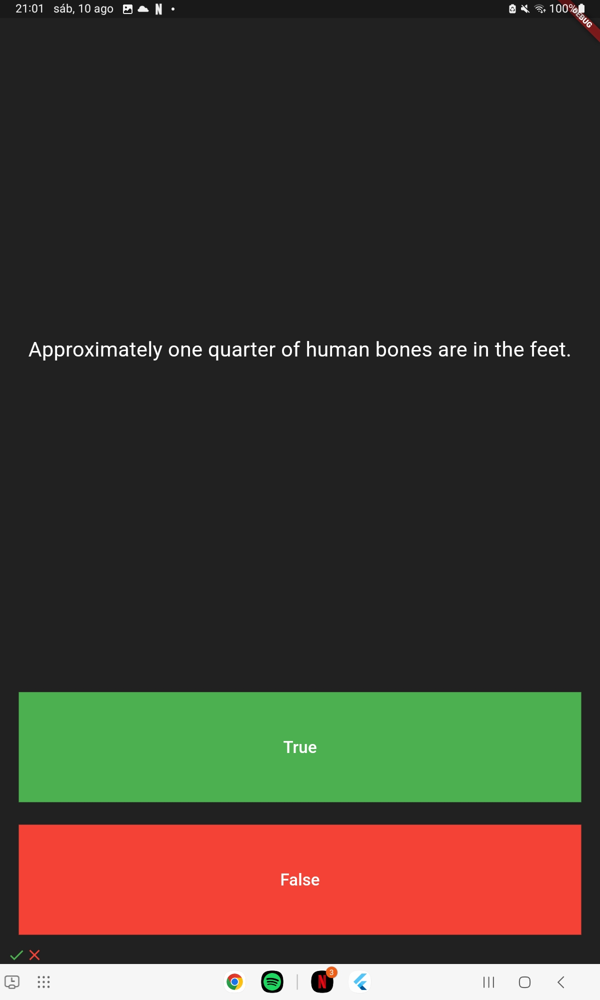

# Quizzler

## Overview

This project is a **True or False Quiz** application built using Flutter and Dart. It allows users to answer a series of true or false questions, with immediate feedback displayed on the screen. The application is designed with key Object-Oriented Programming (OOP) principles, such as encapsulation and abstraction.

## Features

- **Simple Quiz Interface**: The app presents a series of true or false questions that the user can answer by pressing the corresponding button.
- **Feedback System**: After each answer, a checkmark (✔️) is displayed for correct answers, and a cross (❌) is shown for incorrect answers. These icons are stored in a results bar at the bottom of the screen.
- **Alert on Completion**: When the user reaches the last question, an alert notifies them that the quiz is complete, and the quiz then restarts from the beginning.
- **OOP Principles**: The app is built using fundamental OOP principles such as encapsulation and abstraction, ensuring that the code is well-structured and maintainable.

## Usage

1. Press the True or False button to answer the questions.
2. Observe the results at the bottom of the screen.
3. After completing all questions, press "OK" in the alert to restart the quiz.

## Technologies Used

- **Flutter:** The powerful UI toolkit for building natively compiled applications for mobile, web, and desktop from a single codebase.
- **Dart:** The programming language optimized for building fast, multi-platform applications.

## Screenshots

  
  

